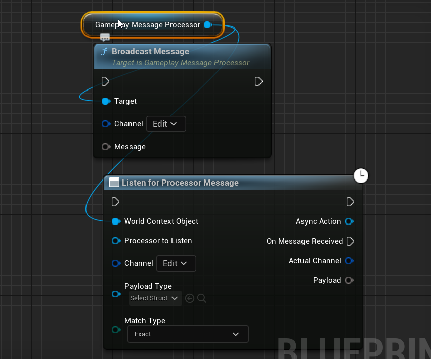
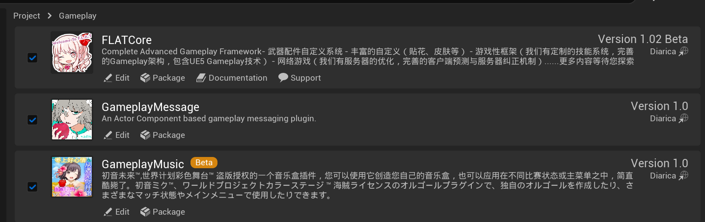

# Diana's Unreal Engine Gameplay Kit
Diana's Unreal Engine Gameplay Kit

Gameplay Message is an actor-component gameplay tag based message system,Which is flexible and also support struct params and blueprint task to broadcast/register messages.(Plugin ready,out of the box)

StackUIManager is an actor-component and gameplay tag based stack state machine UI manager.Add to your APlayerController only.Which is easy to use.(Blueprint ready)

---- NOT RECOMMENDED ----

TagProp : A GameplayTag Extension.A tag pair with a float,networking replication was implemented (FastArrayReplication).
generally use in your gameplay stuff(like inventory/Item properties).instead of hardcode float\int properties.

请订阅我！
我是一个游戏引擎和计算机科学的业余爱好者，在Gameplay上有一些自己的看法，正在完善FLAT Core框架以及以下几个插件。音乐盒插件待数据驱动开发完毕后会考虑开源。

主页链接：https://space.bilibili.com/1268661715?spm_id_from=444.41.0.0

# Diana's Unreal Engine Gameplay Kit
戴安娜的虚幻引擎游戏套件

Gameplay Message 是一个基于角色组件游戏标签的消息系统，它非常灵活，还支持结构参数和蓝图任务来广播/注册消息。（插件就绪，开箱即用）

StackUIManager 是一个基于角色组件和游戏标签的堆栈状态机 UI 管理器。仅添加到您的 APlayerController。易于使用。（蓝图就绪）

 -  -  不建议  -  - 

TagProp：GameplayTag 扩展。实现了带有浮点数的标签对，网络复制（FastArrayReplication）。
通常在您的游戏内容中使用（例如库存/物品属性）。而不是硬编码 float\int 属性。

# Diana's Unreal Engine Gameplay Kit
Diana の Unreal Engine ゲームプレイ キット

ゲームプレイ メッセージは、アクター コンポーネントのゲームプレイ タグ ベースのメッセージ システムです。柔軟で、メッセージをブロードキャスト/登録するための構造体パラメーターとブループリント タスクもサポートしています。(プラグイン対応、すぐに使用可能)

StackUIManager は、アクター コンポーネントおよびゲームプレイ タグ ベースのスタック ステート マシン UI マネージャーです。APlayerController に追加するだけです。使いやすいです。(ブループリント対応)

---- 推奨されません ----

TagProp : GameplayTag 拡張機能。float を備えたタグ ペア、ネットワーク レプリケーションが実装されました (FastArrayReplication)。
通常、ハードコードの float\int プロパティの代わりに、ゲームプレイのもの (インベントリ/アイテム プロパティなど) で使用します。